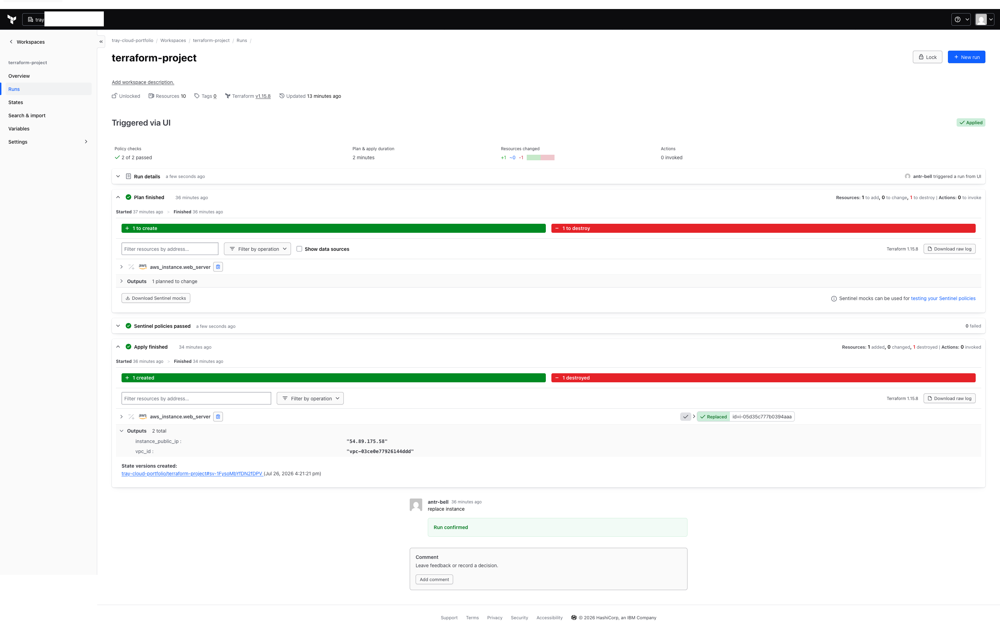
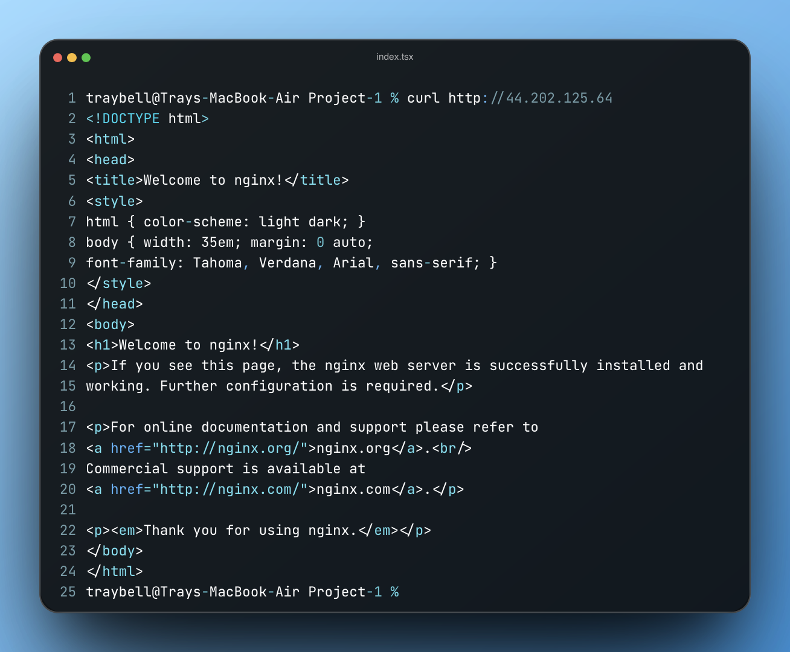
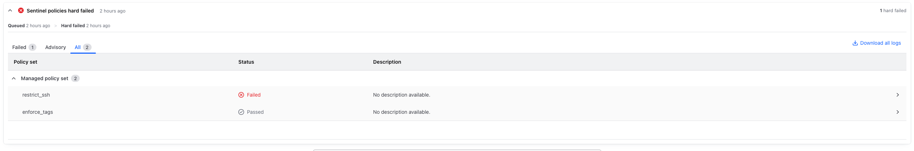

# Automated Secure AWS Web Infrastructure with HCP Terraform & Sentinel

A production-grade, compliance-driven AWS infrastructure deployment managed via **HCP Terraform (Terraform Cloud)** and **Infrastructure as Code (IaC)**. This project demonstrates automated provisioning, proactive policy guardrails using **HashiCorp Sentinel**, tight security controls, and strict cloud billing limits.

---

## Architecture Overview

```text
                        +-------------------------------------------------+
                        |                   AWS Cloud                     |
                        |                                                 |
                        |  +-------------------------------------------+  |
                        |  |                VPC (10.0.0.0/16)          |  |
                        |  |                                           |  |
                        |  |  +-------------------------------------+  |  |
                        |  |  |        Public Subnet (10.0.1.0/24)   |  |  |
                        |  |  |                                     |  |  |
                        |  |  |    +---------------------------+    |  |  |
                        |  |  |    |  EC2 Instance (t3.micro)  |    |  |  |
                  HTTP  |  |  |    |  - Amazon Linux 2023      |    |  |  |
  User -------- (80) ----> |--->   |  - Nginx Web Server       |    |  |  |
                        |  |  |    +---------------------------+    |  |  |
                        |  |  |                 |                   |  |  |
                        |  |  +-----------------|-------------------+  |  |
                        |  |                    v                      |  |
                        |  |          Internet Gateway (IGW)           |  |
                        |  +--------------------|----------------------+  |
                        +-----------------------|-------------------------+
                                                v
                                         Internet Access
```

The architecture consists of a custom Amazon VPC hosting a web server in a public subnet, configured for single-purpose access:

* **VPC & Networking**: Custom IPv4 VPC (`10.0.0.0/16`), Public Subnet (`10.0.1.0/24`), Internet Gateway, and explicit Route Table associations.
* **Security Group Security Model**: Least-privilege design explicitly allowing inbound HTTP (TCP 80) and unrestricted egress, while blocking standard administrative ports (e.g., SSH/22) at the perimeter.
* **Compute Layer**: Amazon Linux 2023 `t3.micro` instance running Nginx, initialized via automated system `user_data` boot scripting.
* **Cost Controls**: Proactive **AWS Budgets** integration configured with a **$0.01 threshold alert** to immediately trigger email notifications upon any unexpected spend.

---

## Governance & Policy Guardrails (Sentinel)

To enforce corporate compliance, security standards, and cost control prior to deployment, all code runs through **HCP Terraform Policy Sets** using HashiCorp Sentinel:

| Policy | Policy Type | Enforced Standard | Validation Status |
| :--- | :--- | :--- | :--- |
| `enforce_tags.sentinel` | **Hard-Mandatory** | Guarantees all cloud resources include organizational `default_tags` (`Environment`, `ManagedBy`, `Project`). | **Passed** |
| `restrict_ssh.sentinel` | **Hard-Mandatory** | Rejects any plan attempting to expose SSH (TCP port 22) to public ingress (`0.0.0.0/0`). | **Passed / Verified** |

> **Policy Verification Note**: Sentinel guardrails were stress-tested by intentionally introducing port 22 ingress rules, successfully triggering policy failure and preventing unauthorized pipeline execution.

---

## File Structure

```text
.
├── billing.tf      # AWS Budget definition ($0.01 threshold with alert notification)
├── compute.tf      # EC2 Instance & cloud-init user_data script for Nginx
├── main.tf         # Terraform & AWS provider config, default resource tags
├── network.tf      # VPC, Internet Gateway, Subnet, Route Table, Security Group
├── outputs.tf      # Workspace output values (VPC ID, Instance Public IP)
├── variables.tf    # Parameterized input definitions (AWS Region, sensitive emails)
└── README.md       # Project documentation
```

---

## Deployment & Execution Workflow

### Prerequisites
1. **AWS Account**: Active account with IAM programmatic access permissions.
2. **HCP Terraform Account**: Connected to your Version Control System (GitHub).
3. **AWS Credentials**: Configured in HCP Terraform Workspace as environment variables (`AWS_ACCESS_KEY_ID`, `AWS_SECRET_ACCESS_KEY`).

### Step-by-Step Deployment

1. **Clone the Repository**
   ```bash
   git clone https://github.com/your-antr-bell/terraform-aws-nginx-sentinel.git
   cd terraform-aws-nginx-sentinel
   ```

2. **Commit & Push Code (Triggers HCP VCS Workflow)**
   ```bash
   git add .
   git commit -m "feat: complete network, compute, and policy infrastructure"
   git push origin main
   ```

3. **HCP Terraform Pipeline Execution**
   - **Speculative Plan**: Evaluates syntax and proposed resource changes.
   - **Sentinel Check**: Runs `enforce_tags` and `restrict_ssh` policy checks.
   - **Apply Phase**: Provisions VPC, Security Groups, EC2 instance, and AWS Budget alerts.

4. **Verify Deployment**
   Retrieve the public IP from output variables and query the Nginx landing page:
   ```bash
   curl http://<INSTANCE_PUBLIC_IP>
   ```

---

## Key Learnings & Engineering Highlights

* **Cloud-Init Execution Lifecycle**: Debugged and resolved instance bootstrap dependency issues where `user_data` required active outbound Internet Gateway routing to pull packages via `dnf`.
* **State Management & Drift Control**: Leveraged HCP Terraform remote state management to decouple local development environments from state storage.
* **Shift-Left Security**: Enforced compliance policy checks early in the CI/CD pipeline before cloud resource allocation occurs.

## Verification & Proof of Execution

To validate that this infrastructure was fully provisioned, governed, and tested, below are execution artifacts from the HCP Terraform pipeline:

### 1. Sentinel Compliance Checks Passing


### 2. Live Web Server Verification


### 3. Proactive Policy Enforcement (Port 22 Block)
